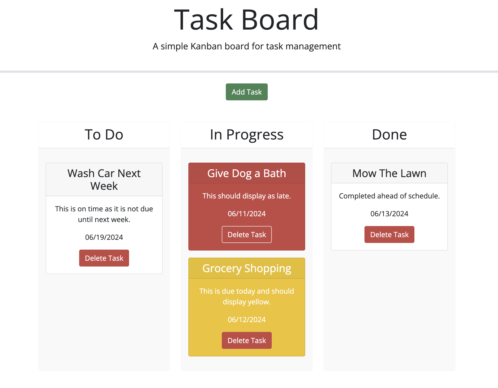

# Task Board

## Description

Create a simple task board application that allows a team to manage project tasks by modifying starter code. This app will run in the browser and feature dynamically updated HTML and CSS powered by jQuery.
You'll need to use the Day.js Links to an external site. library to work with dates. Be sure to read the documentation carefully and concentrate on using Day.js in the browser.

- GIVEN a task board to manage a project
- WHEN I open the task board
- THEN the list of project tasks is displayed in columns representing the task progress state (Not Yet Started, In Progress, Completed)
- WHEN I view the task board for the project
- THEN each task is color coded to indicate whether it is nearing the deadline (yellow) or is overdue (red)
- WHEN I click on the button to define a new task
- THEN I can enter the title, description and deadline date for the new task into a modal dialog
- WHEN I click the save button for that task
- THEN the properties for that task are saved in localStorage
- WHEN I drag a task to a different progress column
- THEN the task's progress state is updated accordingly and will stay in the new column after refreshing
- WHEN I click the delete button for a task
- THEN the task is removed from the task board and will not be added back after refreshing
- WHEN I refresh the page
- THEN the saved tasks persist

## Deployed URL

- https://rich-strain.github.io/task-board/

## Screenshot

